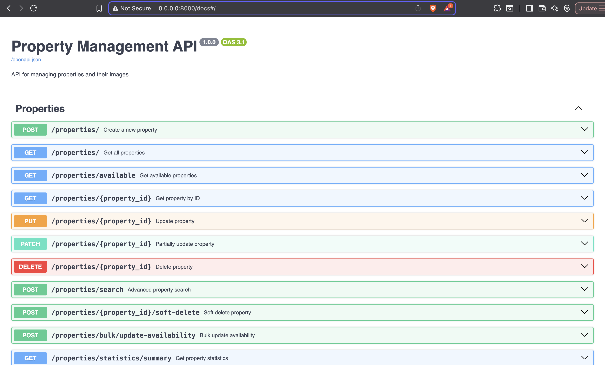
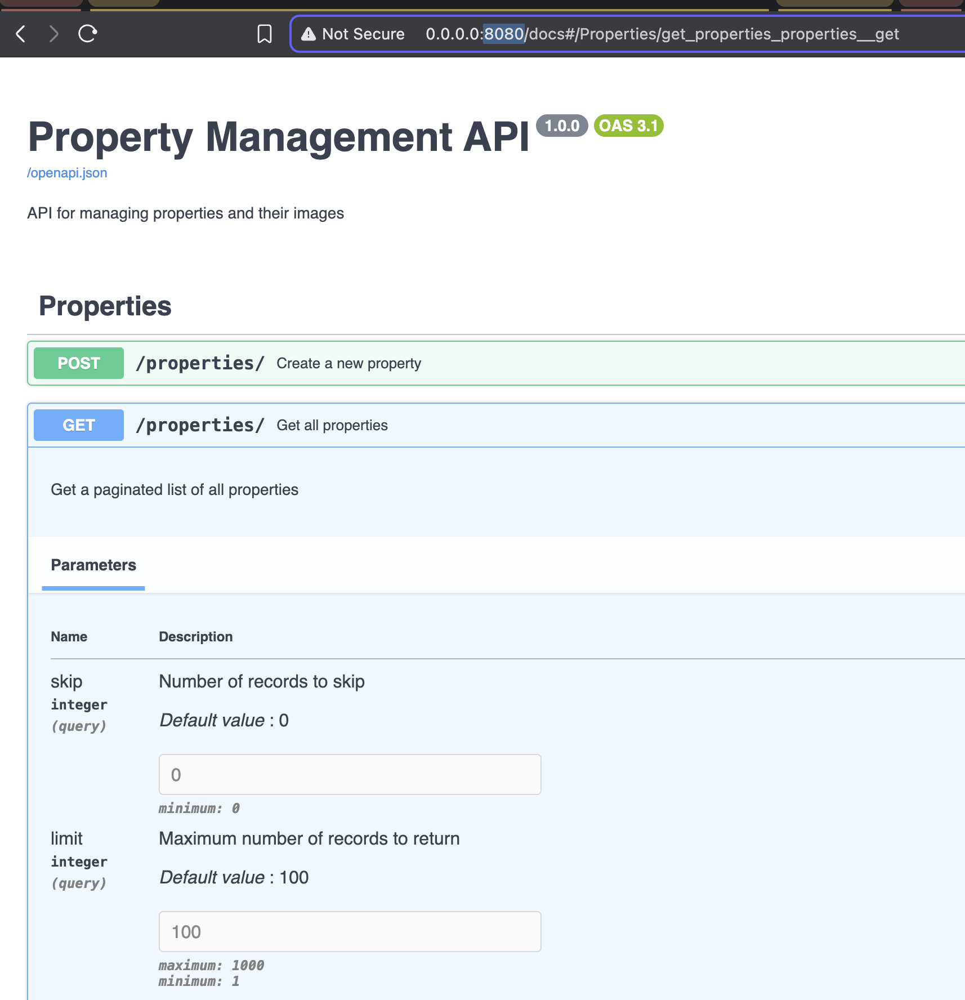
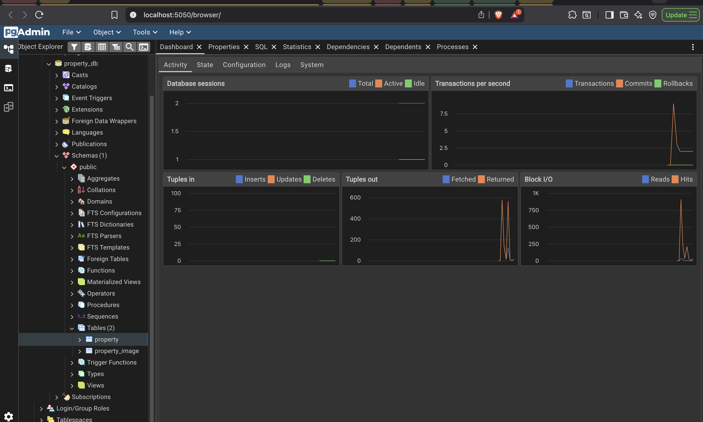
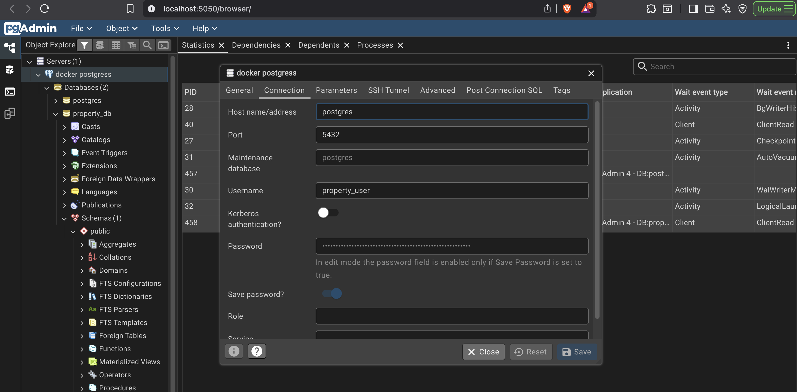
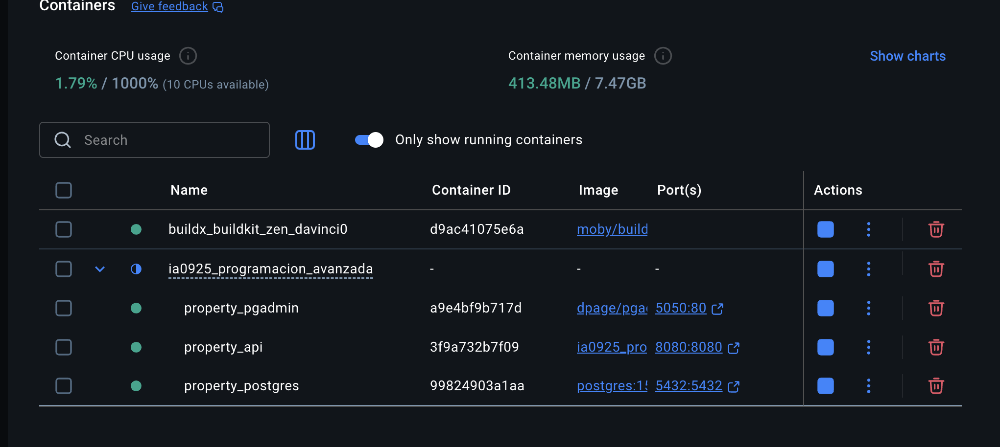
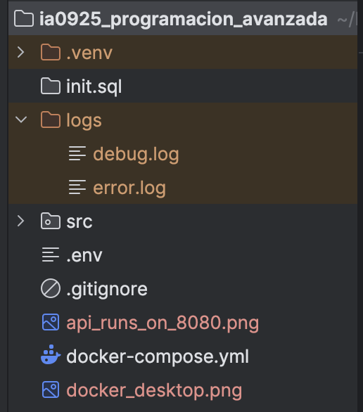

# Real Estate API

API para gestión de propiedades inmobiliarias con FastAPI.

## 📦 Instalación y ejecución con docker

```bash
# Correr con pgadmin e importer de propiedades (recomendado)
docker compose --profile tools up --build -d

# Sin Pgadmin ni importer de propiedades
docker compose up --build -d
```







## 📦 Instalación sin docker

```bash
# Crear entorno virtual (recomendado)
python -m venv .venv
source .venv/bin/activate  # En Windows: .venv\Scripts\activate

# Instalar dependencias
pip install -r requirements.txt
```

## 🚀 Ejecutar el Proyecto

```bash
python main.py
```

La aplicación estará disponible en: http://localhost:8000

**Documentación API:** http://localhost:8000/docs

## 📥 Importar Propiedades

Para cargar datos desde `properties_data.json`:

```bash
python import_properties_from_json.py
```

## 🧪 Ejecutar Tests

```bash
# Todos los tests
pytest tests/ -v

# Tests específicos
pytest tests/test_property_crud.py -v
pytest tests/test_property_image_crud.py -v
```

## 🔧 Endpoints Principales

### Properties
- `GET /properties/` - Listar propiedades
- `POST /properties/` - Crear propiedad
- `GET /properties/{id}` - Obtener propiedad
- `PUT /properties/{id}` - Actualizar propiedad
- `DELETE /properties/{id}` - Eliminar propiedad

### Images
- `GET /images/` - Listar imágenes
- `POST /images/` - Crear imagen
- `POST /images/bulk` - Crear múltiples imágenes
- `GET /images/property/{property_id}` - Imágenes de una propiedad
- `DELETE /images/{id}` - Eliminar imagen


## 📁 Arquitectura
```
app/
├── main.py                 #FastAPI app
├── dependencies.py         #Inyeccion de dependencias
├── config.py               #Configuraciones
├── models/                 #Modelos SQLAlchemy
│   ├── __init__.py
│   ├── property.py
│   └── property_image.py
├── schemas/                #Modelos Pydantic
│   ├── __init__.py
│   ├── property.py
│   └── property_image.py
├── services/               #Lógica del Negocio
│   ├── __init__.py
│   ├── property_service.py
│   └── product_image_service.py
├── repositories/           #Capa de gestión de datos (CRUD)
│   ├── __init__.py
│   └── property_repository.py
│   └── property_image.py
├── routers/                #Ednpoints de la API (urls)
│   ├── __init__.py
│   ├── properties.py
│   └── property_images.py
├── core/                   #Utilidades
│   ├── __init__.py
│   ├── database.py
│   └── logger.py
├── tests/                  #Pruebas de endpoints
    ├── confest.py
    ├── test_property_crud.py
    └── test_property_image_crud.py
```

